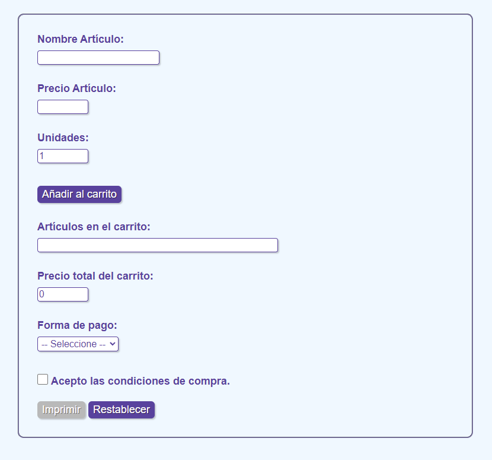

# _CART_

- **Description :**

  This project simulates a basic online shopping cart system implemented in Java. It allows users to add items to their cart, remove items, view the contents of the cart, and calculate the total price of the items. The shopping cart is designed to mimic the behavior of a real-world online shopping experience, providing functionality such as adding items with different quantities, updating item quantities, and removing items from the cart. Additionally, the project includes features for validating user input and handling exceptions. It serves as a practical exercise for understanding object-oriented programming concepts and implementing essential features of an e-commerce application.

---

- **Credits :**

  - **Author : [David Gómez](https://github.com/DavidGomezToca)**
